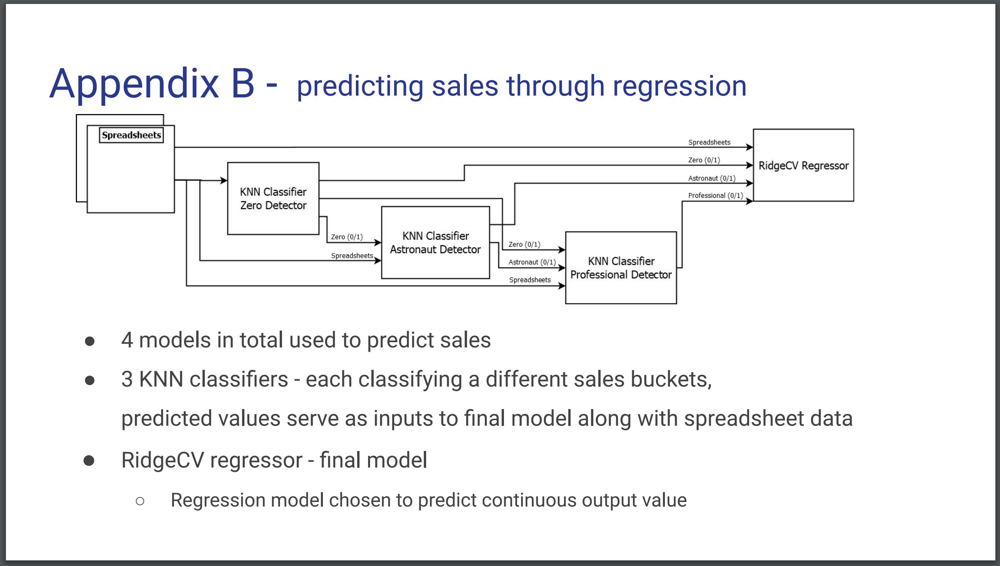
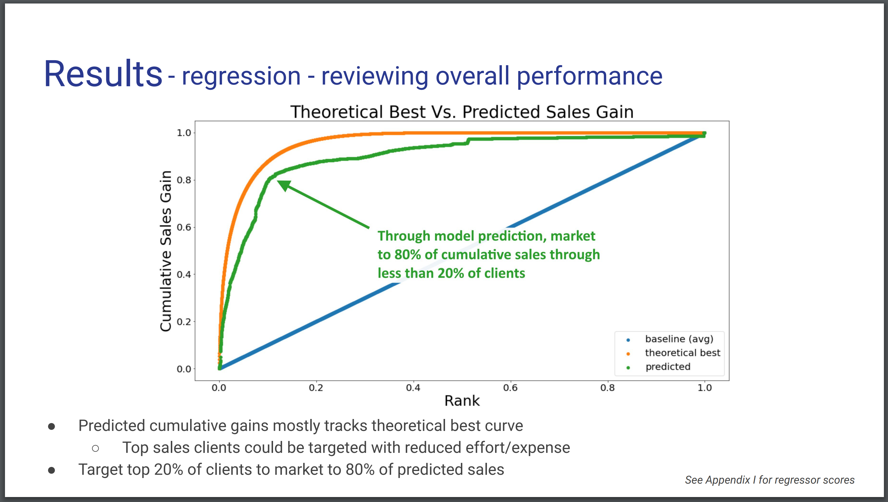
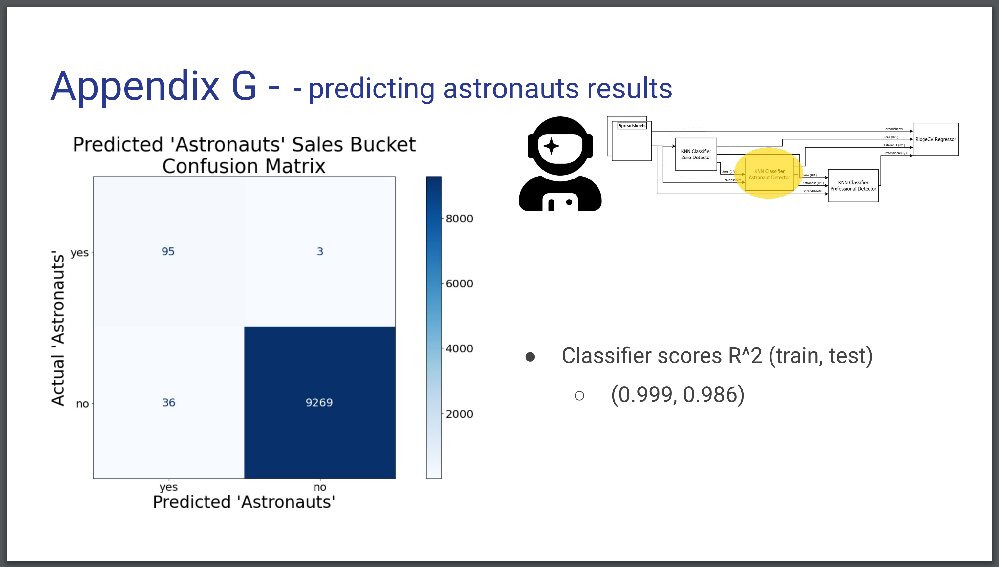
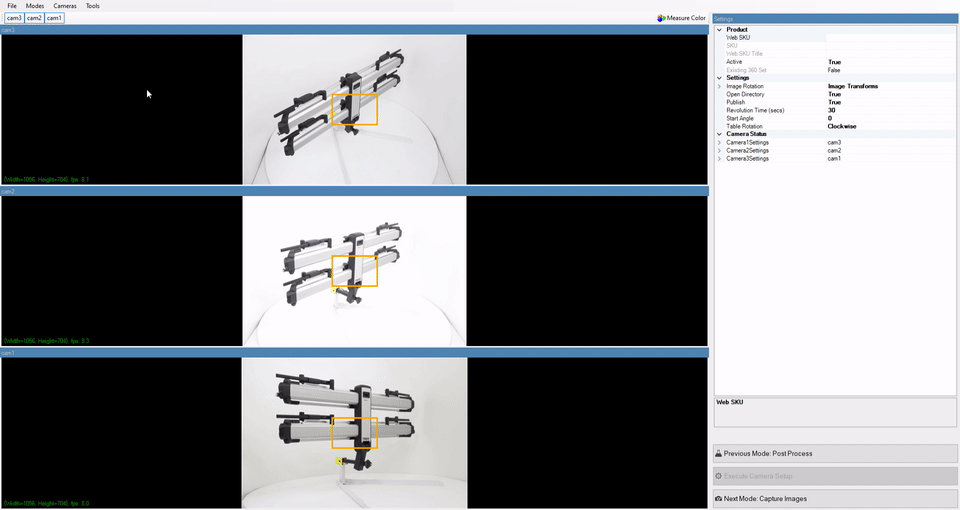
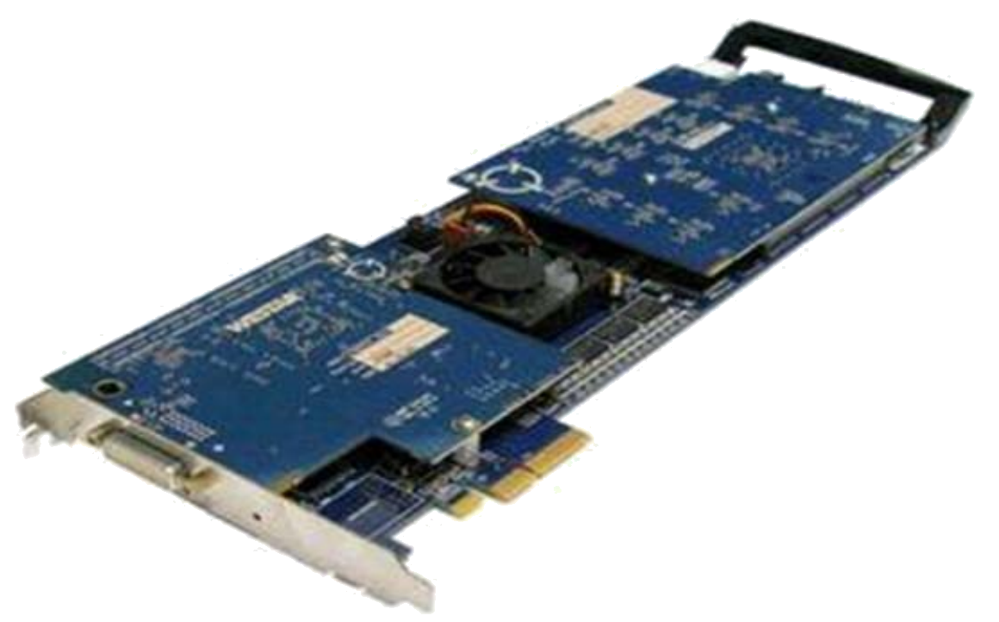
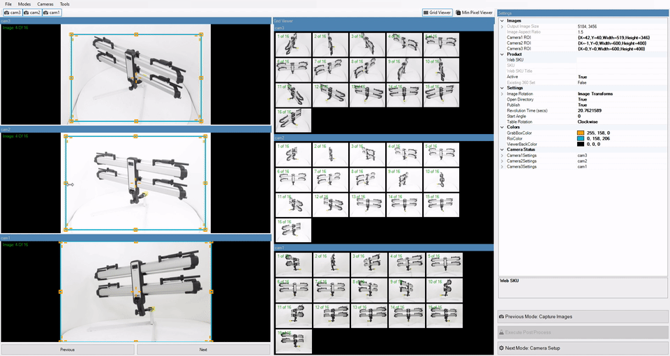

# Nick Heppermann Project Portfolio

Hello, welcome to my project portfolio repository. I've worked on some really rewarding projects and find the challenges so exciting I keep coming back for more.  If you would like to learn more, please peruse the project portfolio.

## :link: [EDPF - broke](./projects/)

## :link: [School Final Project - broke](./projects/)

  

    
  

  

    
  

  

    
  

## :link: [CheezeWhiz](./projects/cheezewhiz_project.md)

  

    
  

  

    
  

## :link: [ExperimentTator](./projects/experimenttator_project.md)

## :link: [Media Publishing Pipeline](./projects/media_pipeline.md)
Media publishing framework that improves content moderator efficiency by processing and publishing media via a background service.  Core features of the media pipeline included:
* Highly parallelized processing
* Resiliency to temporal errors (network connectivity issues)
* Prioritization, scheduling, and automatic retry

Client applications publish work to a data store.  PipelineWorkProcessor application reads work items from the data store, spinning up threads to execute work items in parallel.

## :link: [HRED J2000](./projects/hred_j2000.md)
A hardware implementation of a video compressor/decompressor.

From the marketing materials: 
>The HRED J2000 -- a 4-lane PCIe board that contains a highly parallel JPEG2000 encoding/decoding engine capable of processing multiple video streams simultaneously. The streams can compress video from its PCIe interface or from its up to two DVI-I dual link interfaces, decompress video over its PCIe interface, and perform raw frame captures from its up to two DVI-I dual link interfaces. The HRED J2000 is ideal in command and control scenarios where high resolution video must be moved between multiple video sources, storage devices, and display surfaces. In effect, the HRED J2000 is a JPEG 2000 hardware accelerator!

## Extra

  

    
  

  

    
  

  

    
  

