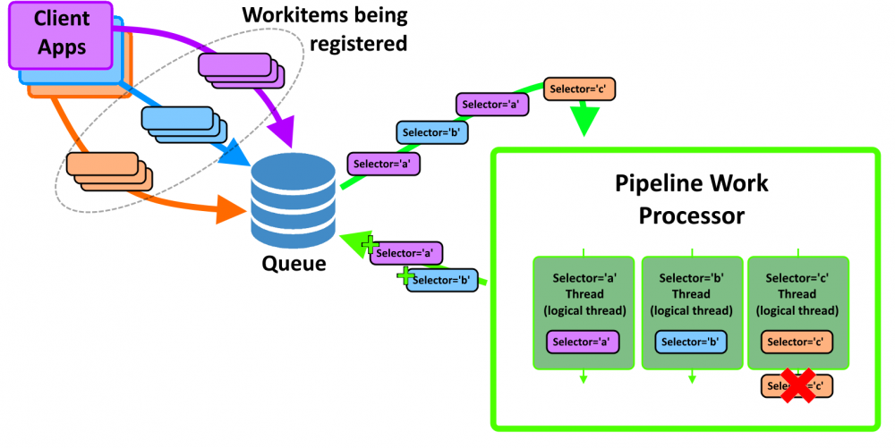

# Nick Heppermann Project Portfolio

[[_TOC_]]

Hello, welcome to my project portfolio repository. I've worked on some really rewarding projects and find the challenges so exciting I keep coming back for new challenges.  If you would like to learn more about my work, please peruse my project portfolio.

<!--

-->

## :link: [Embedded Device Prototyping Framework](https://github.com/nickhepp/embedded-device-prototyping-framework)

Project Ovierview: Less boilerplate coding, more productive prototyping, faster project completion

Embedded Device Prototyping Framework (EDPF) is an embedded device rapid prototyping framework. A lot of time and effort can be spent simply establishing communication back and forth from a host PC to an embedded device uPC. This framework establishes a base infrastructure that removes much of that plumbing work off the backs of developers/designers/hobbyists/etc. This design has been used in numerous applications for both commercial and hobbyist purposes. Please make use of it yourself if it can lighten your load, help you complete your task, and get to what matters in your device -- completing your design.
   
<!--
## :link: [School Final Project - broke](./projects/)

  

    
  

  

    
  

  

    
  

-->

## :link: [CheezeWhiz](./projects/cheezewhiz_project.md)

  

    
  

  

    
  

360 degree spin photography system for capturing, editing, and publishing imagery.  System integrates with multiple Canon DSLR cameras through Canon API to provide live feeds of camera view finders within the software, and image manipulation before publishing the imagery via the  <a href='#media_pub_pipline'>Media Publishing Pipeline</a>.

<!--
## :link: [ExperimentTator](./projects/experimenttator_project.md)
-->

## :link: [Media Publishing Pipeline](./projects/media_pipeline.md)

Media publishing framework that improves content moderator efficiency by processing and publishing media via a background service.  Core features of the media pipeline included:
* Highly parallelized processing
* Resiliency to temporal errors (network connectivity issues)
* Prioritization, scheduling, and automatic retry

Client applications publish work to a data store.  PipelineWorkProcessor application reads work items from the data store, spinning up threads to execute work items in parallel.

## :link: [HRED J2000](./projects/hred_j2000.md)

A hardware implementation of a video compressor/decompressor.

From the marketing materials: 
>The HRED J2000 -- a 4-lane PCIe board that contains a highly parallel JPEG2000 encoding/decoding engine capable of processing multiple video streams simultaneously. The streams can compress video from its PCIe interface or from its up to two DVI-I dual link interfaces, decompress video over its PCIe interface, and perform raw frame captures from its up to two DVI-I dual link interfaces. The HRED J2000 is ideal in command and control scenarios where high resolution video must be moved between multiple video sources, storage devices, and display surfaces. In effect, the HRED J2000 is a JPEG 2000 hardware accelerator!

<!--
## Extra

  

    
  

  

    
  

  

    
  

-->
