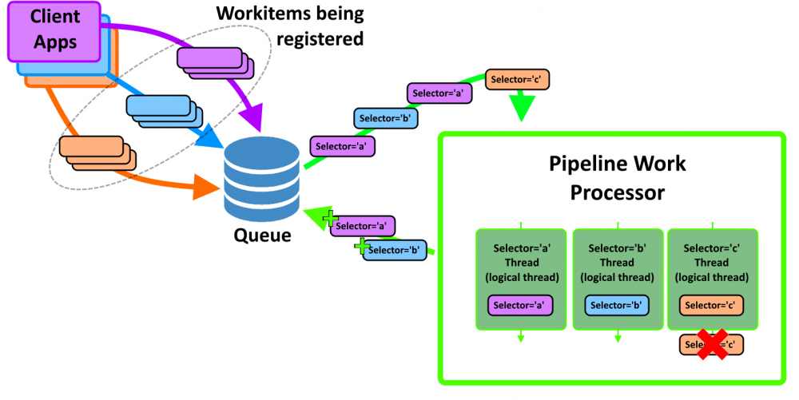

# Media Publishing Pipeline

## Summary

Media publishing framework that improves content moderator efficiency by processing and publishing media via a background service.  Core features of the media pipeline included:

* Highly parallelized processing
* Resiliency to temporal errors (network connectivity issues)
* Prioritization, scheduling, and automatic retry

Client applications publish work to a data store.  PipelineWorkProcessor application reads work items from the data store, spinning up threads to execute work items in parallel.

### Technologies
.NET Framework
SQL Server
